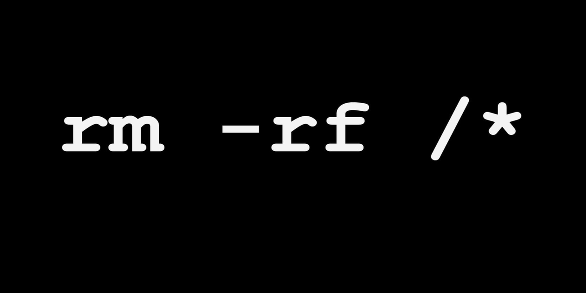

# 🌟 Lisensi UNLICENSE / Public Domain

---

---

## 🇮🇩 Bahasa Indonesia (Terjemahan)

Ini adalah perangkat lunak GRATIS yang dilepaskan ke domain publik. 🆓

Siapa pun bebas untuk <strong>menyalin, memodifikasi, menerbitkan, menggunakan, menjual, atau mendistribusikan</strong> kode ini, baik dalam bentuk <strong>kode sumber maupun biner</strong>, untuk <strong>tujuan komersial atau non-komersial</strong>, tanpa batasan. 🔄

Aku berikan <strong>seluruh hak cipta</strong> ketikan ini, ke <strong>domain publik</strong> untuk <strong>kepentingan publik</strong>.
Ini merupakan <strong>tindakan nyata untuk melepaskan hak cipta sekarang dan di masa depan</strong>. ⚖️

<strong>PERANGKAT LUNAK INI DISEDIAKAN "APA ADANYA"</strong> tanpa jaminan apa pun. Aku <strong>tidak bertanggung jawab</strong> atas klaim, kerusakan, atau masalah lain dari penggunaan kode ini. ⚠️

🔗 Info lebih lanjut: <a href="https://unlicense.org" target="_blank" style="text-decoration: underline; color: #fd7e14;">unlicense.org</a>

---

## 🇬🇧 English (Original)

📖 Klik untuk melihat teks asli (collapse)

This is free and unencumbered software released into the public domain. 🆓

Anyone is free to <strong>copy, modify, publish, use, compile, sell, or distribute</strong> this software, either in source code form or as a compiled binary, for <strong>any purpose</strong>, commercial or non-commercial, and by any means. 🔄

In jurisdictions that recognize copyright laws, the author(s) dedicate <strong>all copyright interest to the public domain</strong>. This is done <strong>for the benefit of the public</strong>, not heirs or successors. This dedication <strong>perpetually relinquishes all present and future rights</strong> under copyright law. ⚖️

<strong>THE SOFTWARE IS PROVIDED "AS IS"</strong> without warranty of any kind, express or implied. Authors are <strong>not liable</strong> for any claims, damages, or issues arising from the use of this software. ⚠️

🔗 More info: <a href="https://unlicense.org" target="_blank" style="text-decoration: underline; color: #007BFF;">unlicense.org</a>

---

## 📝 Ringkasan Penting ⬇️

📊 Klik untuk melihat ringkasan interaktif

🟢 Bebas Hak Cipta: Kode ini gratis dan tidak dibebani hak cipta. 🎉

🌐 Bebas Digunakan Siapa Saja: Siapa pun boleh menyalin, memodifikasi, menerbitkan, menggunakan, menjual, atau mendistribusikan kode ini. 🤝

🎯 Untuk Segala Keperluan: Bisa digunakan untuk tujuan komersial atau non-komersial, tanpa batasan. 🚀

⚠️ Tanpa Jaminan: Disediakan "APA ADANYA". Aku tidak bertanggung jawab atas klaim, kerusakan, atau masalah lain. ❌

---

## 🚀 Ringkasan Visual Interaktif

<table style="width:100%; border-collapse: collapse; text-align: left; margin-top:10px;">
<tr>
<th style="padding: 8px; border-bottom: 2px solid #ccc;">Status</th>
<th style="padding: 8px; border-bottom: 2px solid #ccc;">Penjelasan</th>
</tr>
<tr style="background: linear-gradient(90deg, #28a745, #85e085); color:white;" title="Bebas Hak Cipta 🎉">
<td style="padding: 8px;">🟢 Bebas Hak Cipta</td>
<td style="padding: 8px;">Gratis, tanpa hak cipta 🎉</td>
</tr>
<tr style="background: linear-gradient(90deg, #007BFF, #00d4ff); color:white;" title="Digunakan Siapa Saja 🤝">
<td style="padding: 8px;">🌍 Digunakan Siapa Saja</td>
<td style="padding: 8px;">Untuk komersial/non-komersial 🤝</td>
</tr>
<tr style="background: linear-gradient(90deg, #ffc107, #ffec99); color:black;" title="Untuk Segala Keperluan 🚀">
<td style="padding: 8px;">🎯 Untuk Segala Keperluan</td>
<td style="padding: 8px;">Bebas digunakan untuk semua tujuan 🚀</td>
</tr>
<tr style="background: linear-gradient(90deg, #dc3545, #f8b0b0); color:white;" title="Tanpa Jaminan ❌">
<td style="padding: 8px;">⚠️ Tanpa Jaminan</td>
<td style="padding: 8px;">Aku tidak bertanggung jawab ❌</td>
</tr>
</table>

---

## 🎨 Tips Visual

- Gunakan **emoji / ikon / badge animasi** agar README lebih hidup.  
- Collapse untuk **teks bahasa Inggris**, biar rapi.  
- Ringkasan visual menggunakan **warna & hover effects** untuk menarik perhatian.  
- Bisa dijadikan template untuk **project open source** di GitHub.  

Klik [di sini untuk daftar isi interaktif](https://frijal.github.io/index.html)
